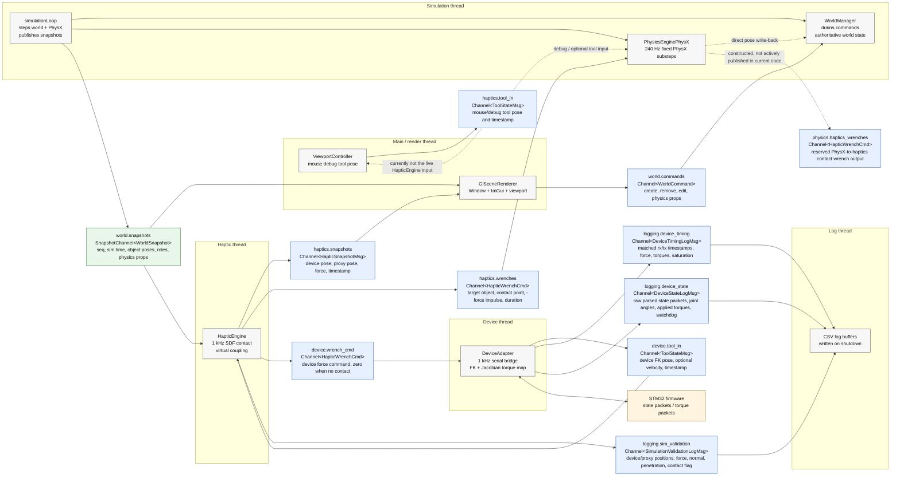

# Thread Message-Bus Diagram

Part of the [[Implementation_Index]] and [[Messaging]] notes.

This diagram shows the runtime threads created in `src/main.cpp` and the named
message-bus channels passed between them.

## Channel Summary

| Channel name | Bus type | Producer thread | Consumer thread(s) | Payload carried |
| --- | --- | --- | --- | --- |
| `world.commands` | `Channel<WorldCommand>` | Main/render | Simulation | Scene mutation requests: create/remove/edit object and set/patch physics properties. |
| `world.snapshots` | `SnapshotChannel<WorldSnapshot>` | Simulation | Main/render, haptic | Latest world state: sequence, simulation time, object ids, geometry ids, poses, velocities, roles, colours, physics properties. |
| `haptics.tool_in` | `Channel<ToolStateMsg>` | Main/render viewport | Main/render viewport, optional PhysX path | Mouse/debug tool pose, optional velocity/button, timestamp. In the current `main.cpp`, this is not the live input passed to `HapticEngine`. |
| `device.tool_in` | `Channel<ToolStateMsg>` | Device | Haptic | Tool pose from device forward kinematics, optional velocity/button, timestamp. This is the live haptic input in the current `main.cpp`. |
| `haptics.snapshots` | `Channel<HapticSnapshotMsg>` | Haptic | Main/render | Device pose, proxy pose, displayed contact force, timestamp. |
| `haptics.wrenches` | `Channel<HapticWrenchCmd>` | Haptic | Simulation / PhysX | Contact wrench for the simulated object: target id, world force, torque, contact point, duration, timestamp. The force is `-F` so the object receives the reaction impulse. |
| `device.wrench_cmd` | `Channel<HapticWrenchCmd>` | Haptic | Device | Force command sent to the physical device path. Carries `+F` in contact and an explicit zero force out of contact. |
| `logging.device_timing` | `Channel<DeviceTimingLogMsg>` | Device | Log | Matched closed-loop timing: rx parse, tool publish, wrench consume, tx start/done, sequence ids, joint angles, force, raw/clamped torques, saturation flags. |
| `logging.device_state` | `Channel<DeviceStateLogMsg>` | Device | Log | Raw parsed firmware state packets: chunk/read timestamps, sequence ids, MCU time, joint angles, applied torques, watchdog and saturation flags. |
| `logging.sim_validation` | `Channel<SimulationValidationLogMsg>` | Haptic | Log | Validation samples: device/proxy positions, force, contact normal, penetration depth, signed SDF distance, contact flag. |
| `physics.haptics_wrenches` | `Channel<HapticWrenchCmd>` | Reserved in PhysX | None active | Constructed and passed to `PhysicsEnginePhysX` as an optional PhysX-to-haptics output, but no active publish path exists in the current code. |

## Bus Type Notes

`Channel<T>` is a mutex-protected FIFO queue. It preserves every message until a
consumer drains or consumes it, which makes it suitable for commands, wrenches,
tool samples, and logs.

`SnapshotChannel<T>` is a double-buffered latest-value channel. It does not queue
history; readers get the newest complete `WorldSnapshot` if its version changed,
which is why it is used for high-frequency world state fan-out.
